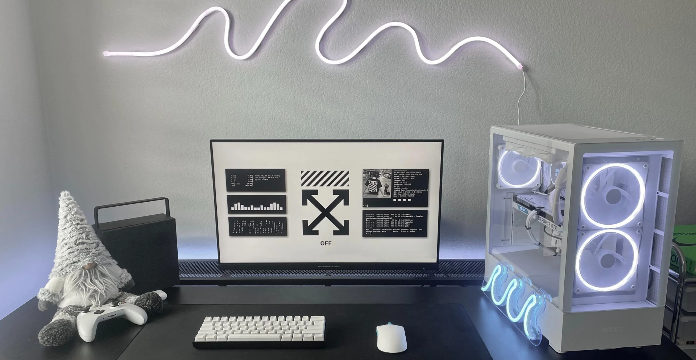
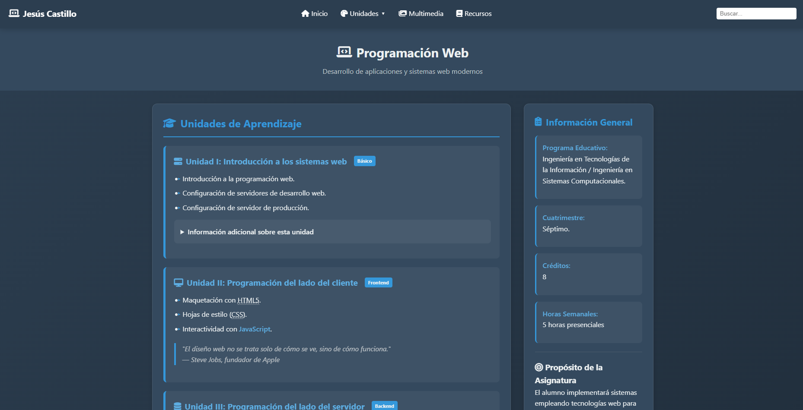

# Portafolio profesional — Jesús Castillo

Portafolio web personal de Jesús Castillo, ingeniero en Tecnologías de la Información. El sitio reúne experiencia, proyectos, formación, certificaciones y medios de contacto en una interfaz responsiva.

## Demo

[Ver portafolio en GitHub Pages](https://jesusacastillo.github.io/Portafolio/)

## Funcionalidades

- Presentación profesional y descarga del currículum.
- Secciones de conocimientos, experiencia, proyectos y certificaciones.
- Navegación adaptable a escritorio, tableta y móvil.
- Selector de idioma en español, inglés y francés.
- Enlaces directos a proyectos, GitHub, LinkedIn y contacto.

## Tecnologías

- HTML5 semántico.
- CSS3 responsivo.
- JavaScript sin dependencias externas.
- GitHub Pages para despliegue.

## Instalación

```bash
git clone https://github.com/JesusACastillo/Portafolio.git
cd Portafolio
python -m http.server 8000
```

Abre `http://localhost:8000` en el navegador. También puedes abrir `index.html` directamente, aunque un servidor local representa mejor el entorno publicado.

## Capturas

### Vista principal



### Diseño responsivo



## Estructura

```text
Portafolio/
├── downloads/     # Currículum descargable
├── icons/         # Iconografía del sitio
├── images/        # Recursos visuales responsivos
├── js/            # Interacciones y traducciones
├── styles/        # Estilos del portafolio
└── index.html     # Página principal
```

## Mejoras futuras

- Automatizar validaciones de accesibilidad y rendimiento.
- Añadir casos de estudio con decisiones técnicas y resultados medibles.
- Incorporar pruebas visuales para las vistas responsivas.
- Optimizar imágenes y metadatos para SEO y redes sociales.

## Autor

**Jesús Castillo** — [GitHub](https://github.com/JesusACastillo)
